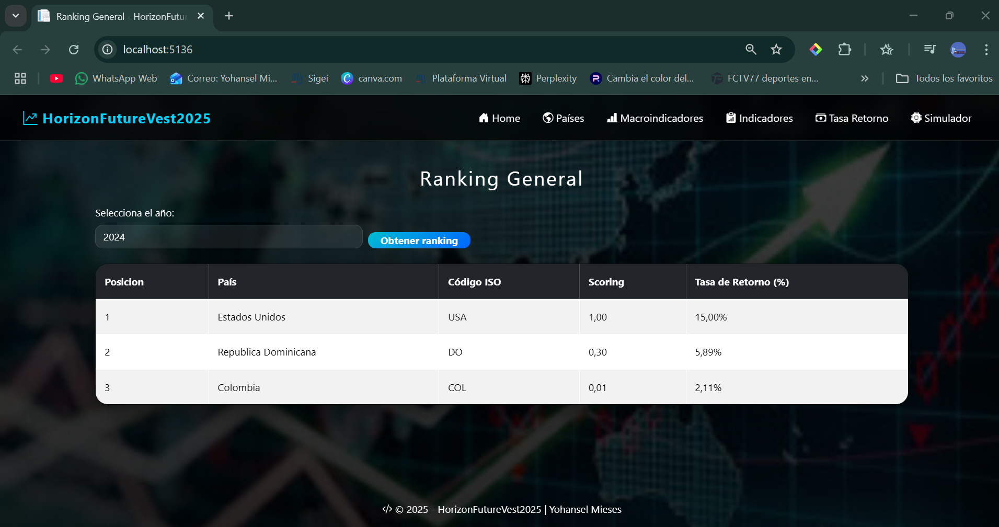
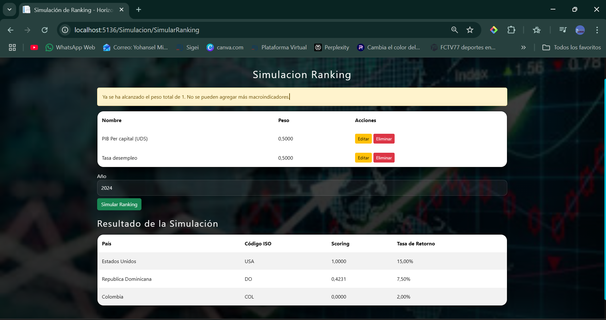
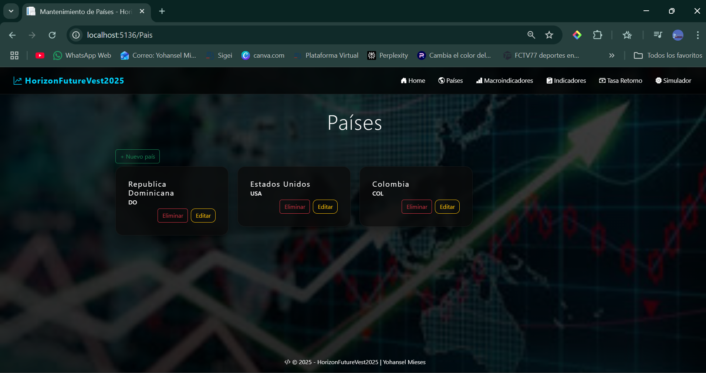
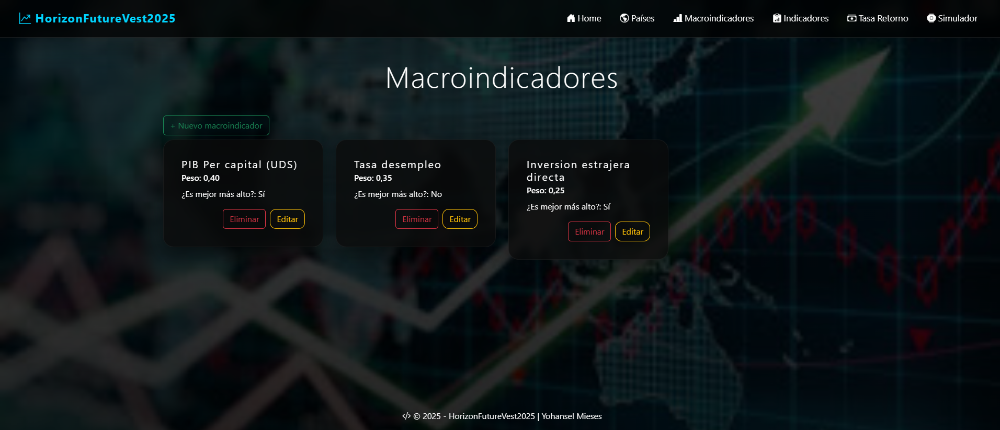
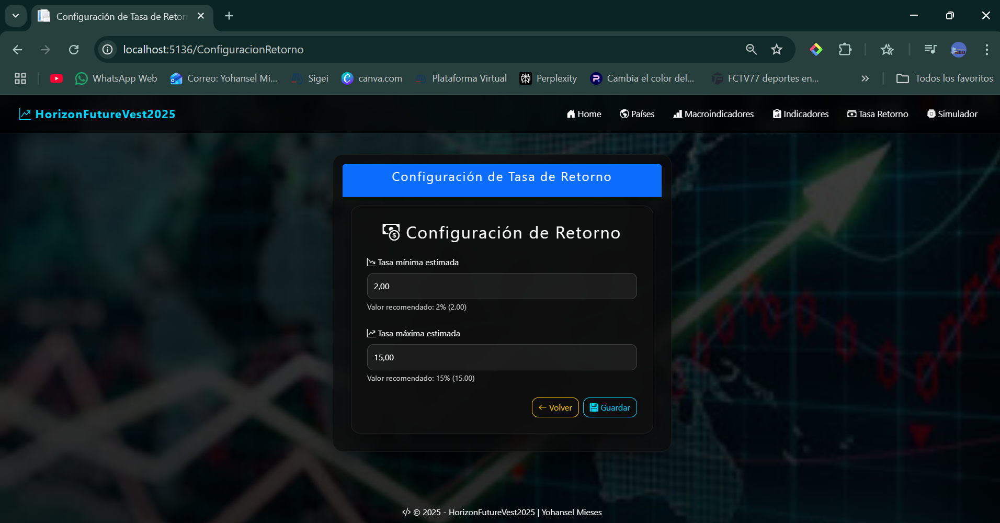

# Horizon FutureVest - Intelligence for Global Investment 📈
**Horizon FutureVest** es una plataforma de análisis macroeconómico de alto nivel diseñada para transformar datos complejos en decisiones de inversión estratégicas. Mediante un motor matemático de **Scoring Ponderado** y **Normalización Min-Max**, el sistema permite evaluar objetivamente el riesgo y la rentabilidad de mercados internacionales. Esta herramienta elimina sesgos analíticos al procesar múltiples indicadores bajo un modelo de escalamiento de datos que garantiza comparaciones precisas entre naciones con realidades económicas distintas.

⚙️ Funcionalidades de Alto Valor
---
- **Motor de Scoring Financiero:** Implementación de algoritmos de normalización para indicadores como PIB e Inflación, diferenciando automáticamente entre métricas de beneficio ("más alto mejor") y de riesgo ("más bajo mejor").
- **Simulador de Escenarios Dinámicos:** Módulo de vanguardia que permite a los usuarios realizar proyecciones en tiempo real ajustando los pesos de los indicadores sin alterar la integridad de los datos históricos guardados.
- **Proyección Lineal de Retorno:** Cálculo automatizado de rentabilidad estimada basado en una función de regresión vinculada al desempeño macroeconómico del país analizado.
- **Validación de Integridad Económica:** Sistema de control que garantiza la precisión del ranking, asegurando que la suma de pesos de los macroindicadores sea exactamente 1.0 antes de procesar resultados.
- **Gestión Multi-País e Interanual:** Administración robusta de indicadores por año y código ISO, permitiendo un seguimiento histórico detallado del crecimiento económico global.

📂 Ingeniería y Arquitectura
---
El proyecto destaca por una arquitectura limpia y desacoplada, demostrando un alto dominio en la separación de responsabilidades y mantenibilidad del software:

- **Domain Layer:** Modelado sólido de entidades núcleo como Países, Macroindicadores y valores de indicadores anuales.
- **Application Layer:** Lógica central que gestiona el motor de normalización, el cálculo de sub-puntajes y la simulación dinámica de rankings.
- **Infrastructure Layer:** Persistencia de datos optimizada mediante **Entity Framework Core** y gestión de parámetros globales de tasas de retorno.
- **Web Interface:** Interfaz moderna y profesional construida con **ASP.NET MVC**, integrando validaciones robustas para garantizar la calidad de los datos ingresados.

🔧 Stack Tecnológico
---
- **Backend:** C# | .NET 9.0 | ASP.NET Core MVC.
- **Data:** Entity Framework Core | SQL Server.
- **Frontend:** Bootstrap 5 | SweetAlert2 | Toastr.
- **Modelado Matemático:** Escalado Min-Max | Regresión Lineal de Retorno.

📸 Galería del Proyecto
---
*En esta sección se presentan las capturas de pantalla que demuestran la potencia analítica y el diseño profesional del sistema.*

* **Dashboard de Ranking y Scoring**
  

* **Simulador de Macroindicadores Dinámicos**
  

* **Mantenimiento de Datos y Países**
  

* **Gestión de Variables Económicas**
  

* **Panel de Control de Tasas de Retorno**
  

## 👨‍💻 Lead Developer
* **Yohansel Mieses** – miesesyohansel@gmail.com
* *Desarrollador de Software enfocado en soluciones robustas, escalables y orientadas a resultados.*
